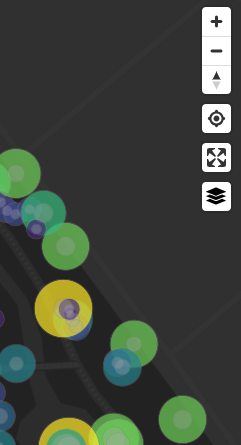
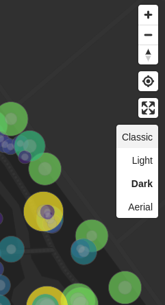

# maplibregl-theme-switcher

A MapLibre control to switch the map background layer.

## Installation:

```bash
npm install https://github.com/EPFL-ENAC/maplibregl-theme-switcher.git --save
```

## Usage:

```ts
import { ThemeSwitcherControl } from "maplibregl-theme-switcher";
import { Map } from "maplibre-gl";

import "maplibregl-theme-switcher/styles.css";

const map = new Map();
map.addControl(new ThemeSwitcherControl());
```

## Options:

If you want to supply your own list of themes, pass them in the constructor. A theme id must match the corresponding layer id.

```ts
import { ThemeDefinition, ThemeSwitcherControl } from "maplibregl-theme-switcher";

const styles: ThemeDefinition[] = [
    {
        label: "Dark",
        id:"dark"
    },
    {
        label: "Light",
        id:"light"
    }
];

// Pass options (optional)
const options: ThemeSwitcherOptions = {
    defaultStyle: "dark",
    eventListeners: {
 // return true if you want to stop execution
 //           onOpen: (event: MouseEvent) => boolean;
 //           onSelect: (event: MouseEvent) => boolean;
 //           onChange: (event: MouseEvent, style: string) => boolean;
    }
};

map.addControl(new ThemeSwitcherControl(styles, options));
```

If you want to specify a default theme, pass them in the constructor as second argument.

```ts
map.addControl(new ThemeSwitcherControl(styles, 'dark'));
```

## Screenshots




